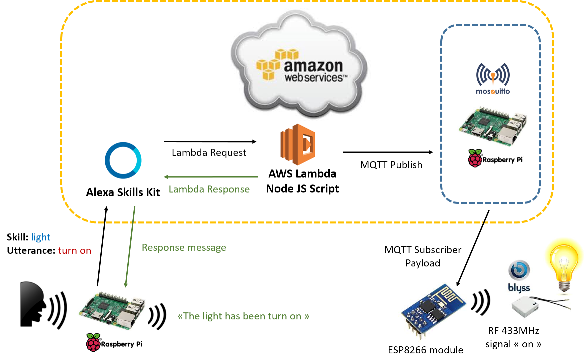

= Alexa Home Lights

This is an AWS Lambda project for Voice Control of Raspberry Pi using AWS Alexa voice service & IoT MQTT.

Base on https://github.com/alexa/alexa-avs-sample-app[Alexa Voice Service (AVS)] on Rasberry PI for Alexa part.
Thanks https://github.com/matt-kruse/alexa-app[alexa-app] a node module and https://github.com/matt-kruse/alexa-app-server[alexa-app-server] to simplify development of Alexa Skills.

Global architecture:

= Installation and Testing

First install https://github.com/matt-kruse/alexa-app-server[alexa-app-server].
Then go in `alexa-app-server\examples\apps` and clone this repository:

[source,bash]
----
cd alexa-app-server\examples\apps
git clone TODO
npm install
----

Run Nodejs server:

[source,bash]
----
cd alexa-app-server\examples
node start
----

You can test the Intents on `http://localhost:8080/alexa/light`

= Deployment

* Zip files `index.js`, `package.json` and the directory `node_modules`
* Go to your https://developer.amazon.com/edw/home.html#/skills/list[Alexa Skills Kit Portal], create new Skill and upload the zip archive

TODO: step-by-step guide

= Resources

* https://github.com/matt-kruse/alexa-app[alex-app]
* https://github.com/alexa/alexa-avs-sample-app[Alexa ASV]
* https://developer.amazon.com/alexa[Alexa Skill Kits]

